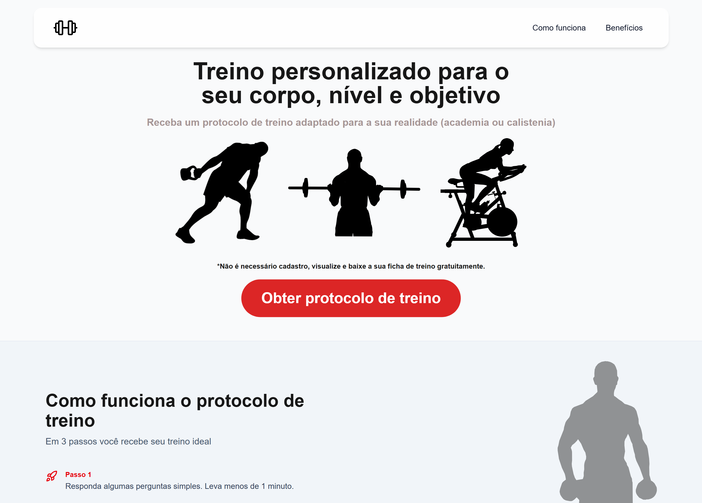
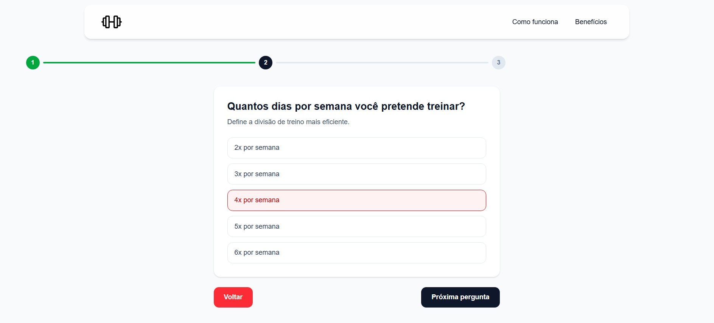
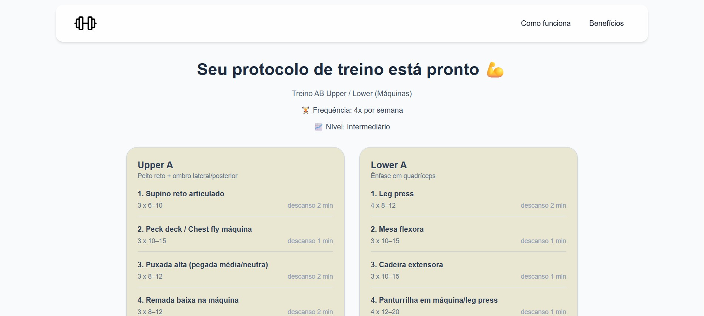
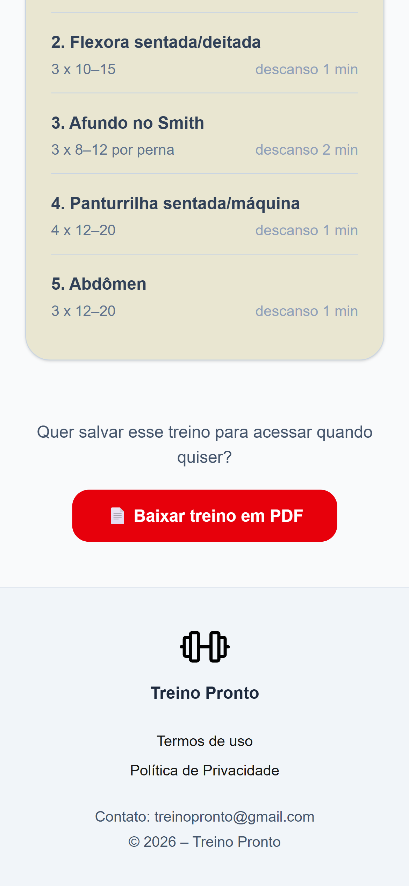

# Treino Pronto

Gere um treino personalizado em menos de 1 minuto, baseado no seu nível, objetivo e rotina — sem cadastro.

## Acesse o projeto

🔗 https://treinopronto.com

## Sobre o projeto

O **Treino Pronto** foi desenvolvido para resolver um problema comum: a dificuldade de montar um treino adequado sem orientação profissional.

A aplicação guia o usuário por um questionário simples e, com base nas respostas, gera um treino personalizado de forma instantânea.

O foco do projeto é oferecer uma experiência rápida, acessível e sem fricção — sem necessidade de login ou armazenamento de dados.

## Funcionalidades

- Questionário interativo passo a passo
- Geração de treino personalizado em tempo real
- Interface responsiva (mobile-first)
- Navegação simples e intuitiva
- Sem necessidade de cadastro

## Tecnologias utilizadas

- Next.js (App Router)
- React
- TypeScript
- Tailwind CSS
- React Hook Form

## Decisões técnicas

- **Sem persistência de dados:**
  As respostas do usuário não são armazenadas em banco de dados, sendo utilizadas apenas durante a sessão para gerar o resultado.

- **Arquitetura com Server e Client Components:**
  Separação estratégica para melhor performance e organização do código.

- **SEO otimizado:**
  Uso de metadata (title, description e keywords) para melhorar indexação e taxa de clique.

- **Componentização:**
  Estrutura modular para facilitar manutenção e escalabilidade.

## Deploy

A aplicação está hospedada na Vercel, com deploy contínuo integrado ao GitHub.

Cada novo commit gera automaticamente uma nova versão do projeto.

## Monetização

O projeto está preparado para integração com anúncios (ex: Google AdSense), respeitando boas práticas de privacidade e experiência do usuário.

## Privacidade

O projeto foi construído com foco em privacidade:

- Nenhum dado pessoal é armazenado
- Nenhuma informação é compartilhada com terceiros
- O processamento ocorre apenas durante a navegação

## Autor

Desenvolvido por Roberto Júnior

## Preview

### Home

  

### Questionário

  

### Resultado

  

### Mobile

  

